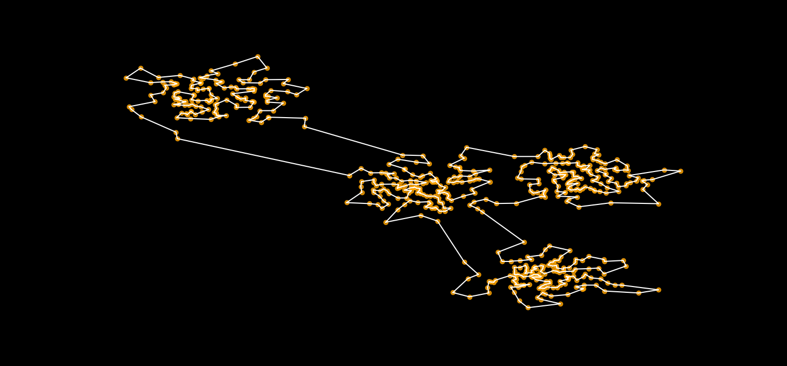

# Decision-TSP
## Entscheidungsverfahren mit Methoden des maschinellen Lernens

  

Projekt zur Datenanalyse WiSe 2023 Hochschule Bonn-Rhein-Sieg
Angefertigt von:
- Paul Brenker
- Nico Nowak

| Links:       |   |
|--------------|---|
| Präsentation |[Overleaf](https://de.overleaf.com/read/ypcqznfvbzbx#23b2c7)|
| Projekt Management |[Trello](https://trello.com/invite/b/v0lDgIsF/ATTI0190e03796fcfcdd58dd92254aa3f82530527181/decision-tsp)|

## Nutzung
Alle verwendeten Dependencies sind über [Poetry](https://python-poetry.org/) gemanaged und können über eine virtuelle Umgebung direkt _out of the box_ verwendet werden:

- Installiere alle Dependencies: `poetry install` 
- Starte Entwicklungsumgebung: `poetry run jupyer-lab`

## Repository Struktur
Dieses Repository hat folgende Inhalte:
#### Jupyter Notebooks:
- **data_analysis:** Datenanalyse Pipeline, um Datensätze zu visualisieren, Regressionsmodelle zu trainieren und zu testen.
- **clustered_set:** Mit diesem Jupyter Notebook kann ein neuer TSP Datensatz erstellt werden, der bereits Daten zur optimalen Tour enthält
- **heuristics_pipeline:** Für einen vorhandenen TSP Datensatz mit standardisierter `json` Struktur kann mithilfe dieses Notebooks effizient alle relevanten Heuristiken berechnet werden.

#### Python Module:
- **fileops:** Speicher und Ladeoperationen um Daten aus dem Dateisystem zu laden und zu speichern. Spezialisierte Methoden für JSON.
- **heuristics:** Methoden um Heuristiken auf TSP Daten zu berechnen: Minimaler Spannbaum, Minimale Spannbaum Heuristik, Nearest Neighbor, Nearest Insertion, Farthest Insertion, Random Insertion, Greedy Heuristik, Christofides Algorithmus, 1-Tree Algorithmus
- **regressions:** Funktionen, die ein TSP Datenset in Trainingsmenge und Validierungsmenge aufteilen und mit ein gegebenes Regressionsmodel trainieren. Auf dem Model können mit den gegebenen Methoden auch direkt Analysen durchgeführt werden.
- **visualisations:** Visualisierungen rund um das Thema TSP, Touren, Heuristiken und Analyse der Regressionsmodelle.

#### Datensätze
1) TSP Datensatz: 2000 Instanzen mit gleichverteilten Knoten, extensives Heuristic Set (inklusive LP-Relaxation und Assignment Relaxation). _Erstellt von: Peter Becker_
2) Geclusterter TSP Datensatz: 2000 Instanzen, die jeweils 3 bis 6 Cluster enthalten, um die Knoten normalverteilt sind. Heuristiken enthalten keine Daten zu Assignment und LP Relaxation _Erstellt von: Paul Brenker_
3) Geclusterter TSP Datensatz 1000 Instanzen, die jeweils 1 enthalten, um das Knoten normalverteilt sind. Heuristiken enthalten keine Daten zu Assignment und LP Relaxation _Erstellt von: Peter Becker_
