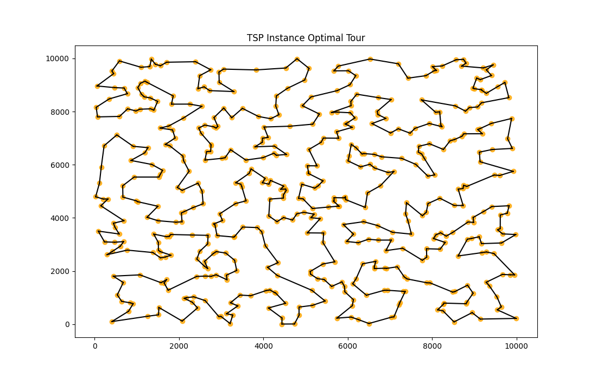
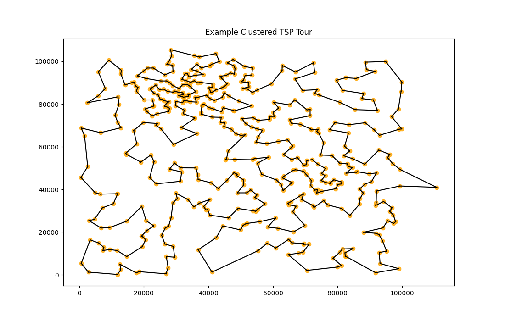
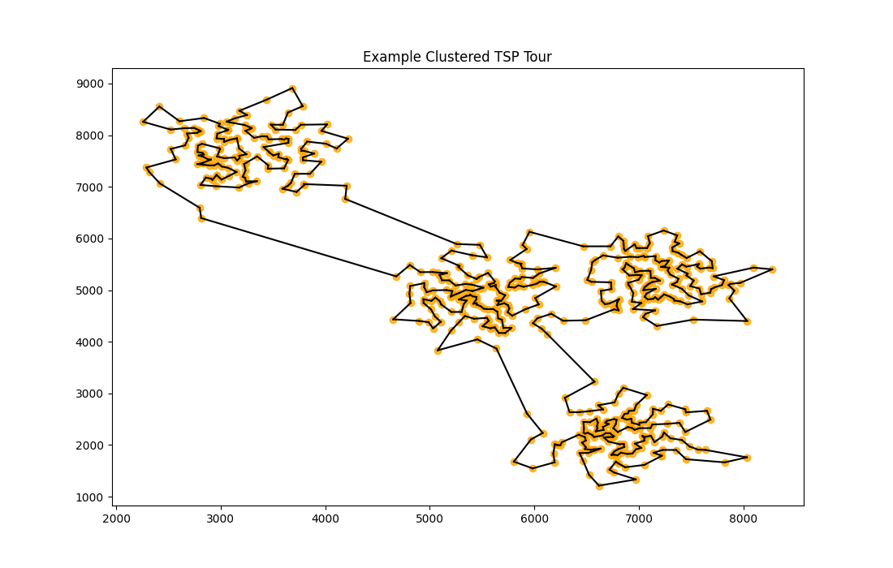
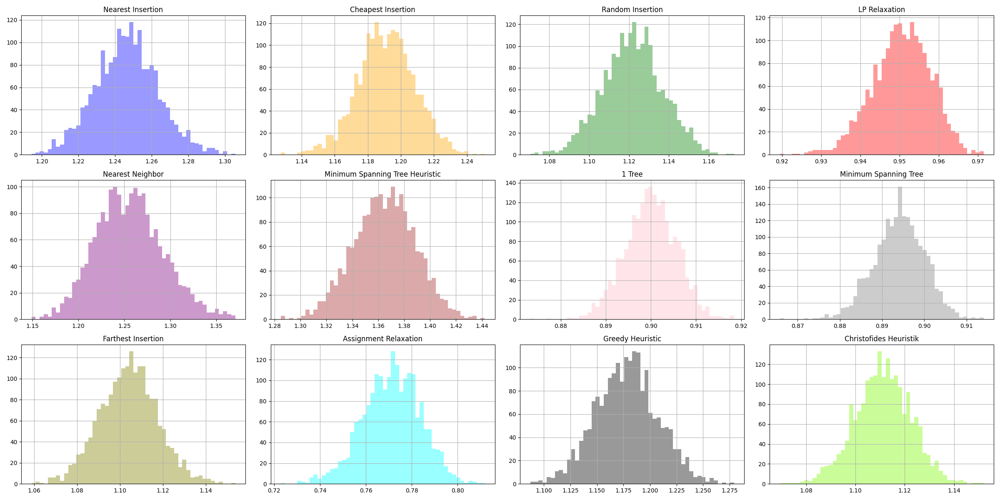
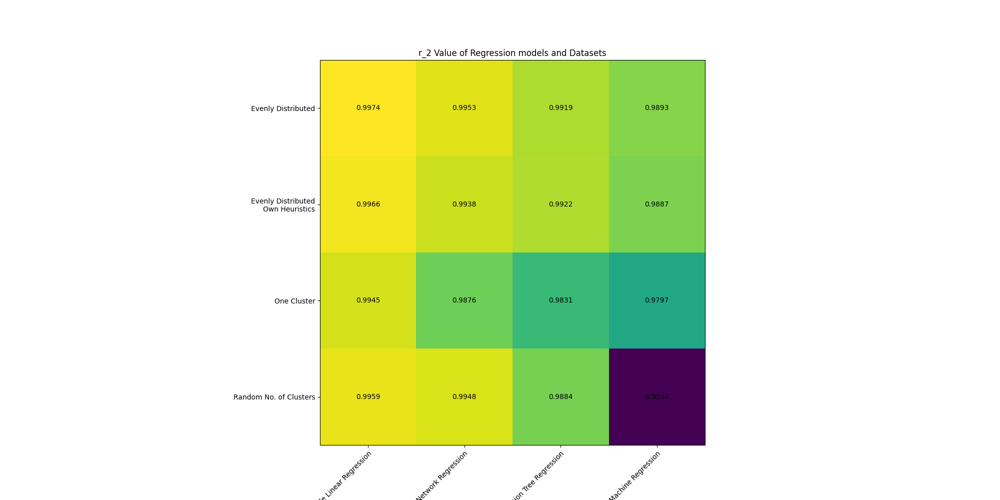

# Decision-TSP

## Solving decision-making processes with machine learning

- [Objectives](#objectives)
- [Data](#data)
- [Heuristics](#heuristics)
- [Regression Models](#regression-models)
- [Results](#results)
- [Repo](#repo)

## Objectives

When tackling NP-hard problems like the Traveling Salesman Problem (TSO), exact solutions quickly become infeasible for larger graphs. Deciding whether a round tour covering all vertices of a weighted graph shorter than exists is called the Decision TSP and is like the regular TSP an NP-hard problem. Inspired by Prates et. Al. 2018 we want to use machine learning methods to solve the decision TSP problem. Instead of using a complex Graph Neural Network (Prates et. Al. 2018) we will use simpler methods trained on previously calculated heuristics. All heuristics are computable in polynomial time meaning none of them can promise outputting optimal tours.

## Data

We are working with three datasets each containing data for thousands of graph instances including pre-computed heuristics and the optimal TSP-tour length.

1. **TSP-Dataset:** 2000 instances with equally distributed vertices. This features an extensive set of heuristics including LP-Relaxation and Assignment-Relaxation. Created by _Prof. Peter Becker_

2. **Single Clustered TSP:** 1000 instances with each one cluster center around which vertices are normally distributed. Heuristics are self computed and contain no data about LP-Relaxation and Assignment-Relaxation. Created by _Prof. Peter Becker_

3. **Multi Cluster TSP:** 2000 instances with random number of clusters (with a maximum of 6 cluster centers per instance). Heuristics are self computed and contain no data about LP-Relaxation and Assignment-Relaxation. Created by _Paul Brenker_

## Heuristics

We are using 9 heuristics computed for every graph instance including 2 lower bounds and 7 tour approximations. These provide a fast estimate of a short valid Hamiltonian circle while avoiding exponential run times.

| **Heuristic Type** | **Heuristic Name**              | **Mean Relative Diversion from Optimal Tour** |
| ------------------ | ------------------------------- | --------------------------------------------- |
| **Lower Bound**    | 1-Tree                          | 0.899                                         |
|                    | Minimum Spanning Tree           | 0.894                                         |
| **Approximation**  | Nearest Insertion               | 1.246                                         |
|                    | Random Insertion                | 1.121                                         |
|                    | Nearest Neighbor                | 1.255                                         |
|                    | Minimum Spanning Tree Heuristic | 1.364                                         |
|                    | Farthest Insertion              | 1.104                                         |
|                    | Greedy Heuristic                | 1.178                                         |
|                    | Christofides                    | 1.111                                         |

## Regression models

We are using four regression models to learn the optimal tour length from the given input of heuristics and optimal tour lengths of each graph.

- **Multiple Linear Regression**
- **Decision Tree Regressor**
- **Neuronal Network**
- **Vector Support Machine Regression**

Each Data Set is separated in training data-set and a verification set that we are using to verify the results. Different accuracies of prediction are verified for various training set sizes are recorded. The bigger the training set the more accurate the prediction of the optimal tour and the smaller the error.

## Results

Using Heuristics as input we can predict the optimal tour length with high precision and thus with high probability solve decision TSP without exponential runtime. In comparison to Prates et. Al 2018 we reduced model complexity while improving prediction accuracy. Out of the used regression model Multiple Linear Regression was the most suitable model for the data.

As expected the predictions are most accurate for the equidistributed data-set. For the more complexly distributed data the predictions are less precise but still impressively showcase validity of the method.

## Repo

- **Jupyter Notebooks:**
  - **Creating Datasets:** With the [`clustered_set.ipynb`](clustered_set.ipynb) jupyter notebook a new TSP dataset can be constructed including the optimal tour length computed with the Concorde Solver.
  - **Computing Heuristics:** New Heuristic data can be computed with the [`heuristics_pipeline.ipynb`](heuristics_pipeline.ipynb). Data is provided in a consistent `json` structure.
  - **Data Analysis Pipeline:** Data-analysis pipeline to compute regressions and to visualize heuristics is in [`data_analysis`](data_analysis.ipynb).
- **Python Modules:** All used dependencies are managed with the [Poetry](https://python-poetry.org/) dependency manager and can be used in a virtual environment directly out of the box with `poetry install`.
  - **Heuristics:** Module to compute heuristics on TSP instances.
  - **Regressions:** Module to compute four regressions for data.
  - **Visualizations:** Abstracting visualizations to reusable functions.
- **Final Presentation (German):** Find the `.tex` file and the presentation `.pdf` [here](presentation)

This project was created by **Paul Brenker** and **Nico Nowak** in the course _Projekt zur Datenanalyse_ 2023 at the **Hochschule Bonn-Rhein-Sieg**.
